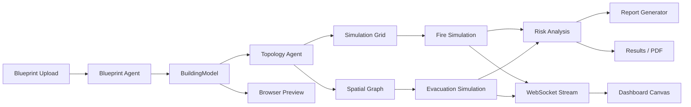
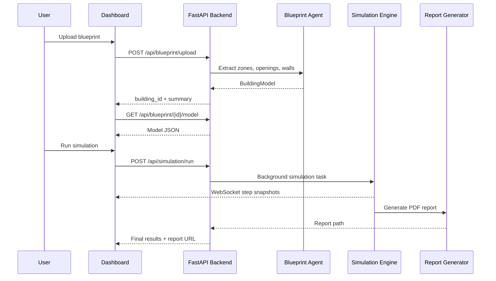
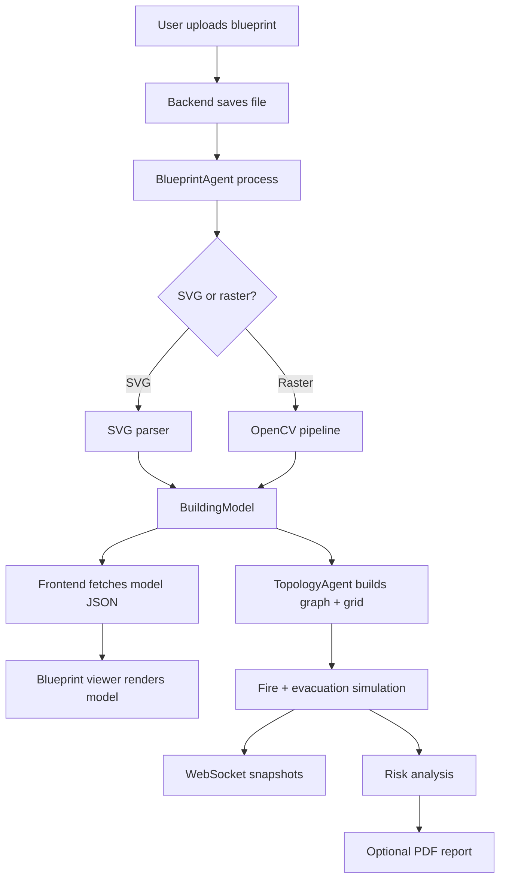

# FirePBD Engine

FirePBD Engine is a performance-based fire safety analysis platform that turns building blueprints into a navigable building model, then runs fire spread, evacuation, risk, optimization, and report workflows on top of that geometry.

It combines:

- blueprint extraction from SVG and raster floor plans
- zone/opening/wall modeling
- topology graph generation
- wall-aware path preview in the browser
- live fire and evacuation simulation
- RSET / ASET analysis
- PDF report generation

---

## Product snapshot

| Area | What it does |
|---|---|
| Blueprint ingestion | Upload PNG, JPG, BMP, or SVG floor plans |
| Geometry extraction | Detect zones, openings, exits, and walls |
| Simulation | Run fire spread and evacuation dynamics |
| Risk | Calculate tenability, ASET, RSET, and margin |
| UI | Browser dashboard with live canvas preview and WebSocket updates |
| Reporting | Generate downloadable PDF reports |

---

## High-level architecture



---

## End-to-end workflow



---

## What the platform does

### Blueprint processing
- Parses CubiCasa SVG floor plans directly when available.
- Falls back to OpenCV-based image processing for raster images.
- Extracts rooms/zones, walls, doors/openings, and exits.
- Normalizes the result into a `BuildingModel`.

### Simulation
- Builds a discrete fire grid from the building geometry.
- Simulates fire spread, temperature, smoke, visibility, oxygen, and CO.
- Simulates evacuation agents moving through the spatial graph.
- Streams live snapshots to the browser over WebSocket.

### Risk analysis
- Computes tenability and safety time metrics.
- Derives RSET / ASET and margin assessment.
- Supports Monte Carlo analysis and optimization recommendations.

### UI
- Shows a live blueprint viewer.
- Renders route previews and zone selection.
- Displays live fire/smoke/agent overlays.
- Provides report preview and download actions.

---

## Repository layout

```text
FirePBD_Engine/
├── backend/
│   ├── agents/          # blueprint, topology, fire, evacuation, risk, optimization, report
│   ├── core/            # geometry, graph, grid, constants, simulation state
│   ├── utils/           # image processing, repair, validation, math, logging
│   ├── data/            # input blueprints, processed outputs, reports, simulation cache
│   └── main.py          # FastAPI app entrypoint
├── frontend/
│   ├── index.html       # dashboard shell
│   ├── dashboard.js     # upload, state management, WebSocket playback
│   ├── simulation.js    # simulation canvas renderer
│   ├── viewer.js        # blueprint viewer renderer
│   └── style.css        # UI styling
├── datasets/            # sample blueprint datasets
├── backend/tests/       # pytest suite
├── smoke_test.py        # lightweight end-to-end smoke test
└── requirements.txt     # Python dependencies
```

---

## Supported file formats

- **SVG**: preferred for CubiCasa-style annotated plans
- **PNG**
- **JPG / JPEG**
- **BMP**

---

## Runtime pipeline



---

## Simulation and analysis stack

### Core concepts
- **Zone**: a polygonal spatial region.
- **Opening**: a passable connection between zones.
- **WallSegment**: a wall barrier in world coordinates.
- **BuildingModel**: a full parsed building, including geometry and metadata.
- **Grid**: the discretized simulation field.
- **SpatialGraph**: the zone adjacency graph used for routing.

### Fire model
- Tracks burning, burned, wall, and opening cells.
- Updates temperature, smoke, CO, oxygen, and visibility.
- Uses a preview-friendly streaming cadence in the UI.

### Evacuation model
- Populates agents from the building model.
- Routes them through the graph and around hazardous zones.
- Reports progress through live snapshots and final summaries.

---

## API surface

### Blueprint endpoints

- `POST /api/blueprint/upload`
  - Upload a blueprint file.
  - Returns `building_id` and extraction summary.

- `GET /api/blueprint/{building_id}/model`
  - Returns the extracted `BuildingModel` as JSON.

- `GET /api/blueprint/{building_id}/source`
  - Downloads the original uploaded blueprint.

- `GET /api/blueprint/{building_id}/zones`
  - Returns zone/opening summary for the selected building.

### Simulation endpoints

- `POST /api/simulation/run`
  - Starts the full fire + evacuation + risk pipeline.

- `GET /api/simulation/{sim_id}/status`
  - Polls simulation progress.

- `GET /api/simulation/{sim_id}/results`
  - Returns final results JSON.

- `GET /api/simulation/{sim_id}/report`
  - Downloads the generated PDF report.

- `POST /api/simulation/{sim_id}/optimize`
  - Generates optimization recommendations.

- `WS /api/simulation/{sim_id}/stream`
  - Streams live simulation snapshots.

### Health

- `GET /api/health`
  - Checks backend availability and loaded model count.

---

## Setup

### Requirements
- Python **3.10** or **3.11**, 64-bit
- Windows, macOS, or Linux
- A browser with WebSocket and Canvas support

### Install

```powershell
python -m venv venv
venv\Scripts\activate
python -m pip install --upgrade pip
python -m pip install -r requirements.txt
```

### Run

```powershell
python -m uvicorn backend.main:app --reload --port 8000
```

Open:

```text
http://127.0.0.1:8000/app
```

---

## Configuration

Configuration is loaded from environment variables via `backend/config.py`.

| Variable | Default | Description |
|---|---:|---|
| `API_HOST` | `0.0.0.0` | Backend bind host |
| `API_PORT` | `8000` | Backend port |
| `API_RELOAD` | `true` | Uvicorn reload mode |
| `CORS_ORIGINS` | `*` | Allowed origins |
| `MAX_UPLOAD_MB` | `20` | Upload size cap |
| `GRID_CELL_SIZE` | `1.0` | Default simulation grid cell size |
| `SIM_STEPS` | `240` | Default simulation duration |
| `MC_RUNS` | `500` | Default Monte Carlo runs |
| `ENABLE_MC` | `true` | Toggle Monte Carlo |
| `ENABLE_OPT` | `true` | Toggle optimization recommendations |
| `ENABLE_PDF` | `true` | Toggle PDF generation |
| `LOG_LEVEL` | `INFO` | Logging level |
| `COMPANY_NAME` | `FirePBD Engine` | Report branding |
| `REPORT_LOGO` | empty | Optional report logo path |

---

## Example user flow

1. Upload a blueprint.
2. Review the extracted model and live blueprint preview.
3. Click a zone to inspect a wall-aware egress route.
4. Configure the scenario and run the simulation.
5. Watch the live fire and evacuation playback.
6. Review RSET / ASET, risk score, and recommendations.
7. Download the PDF report.

---

## Performance notes

- The dashboard uses lazy rendering to keep large blueprints responsive.
- Route previews are built only when the model is suitable for spatial solving.
- The backend keeps simulation state in memory for fast iteration.
- Monte Carlo and PDF generation can be disabled for lighter runs.

---

## Troubleshooting

### Upload hangs or the browser becomes slow
- Use SVG when possible; it is the most accurate path.
- Large raster blueprints can be expensive to process.
- Close other tabs if the browser is under memory pressure.
- Keep simulation settings moderate while testing new plans.

### API does not start
- Confirm the virtual environment is active.
- Confirm dependencies are installed from `requirements.txt`.
- Check `backend/config.py` and your `.env` values.

### No model appears after upload
- The blueprint may have too little geometry for extraction.
- Try a higher-quality SVG or a cleaner floor plan image.
- Check backend logs for processing warnings.

### PDF is missing
- Ensure PDF generation is enabled.
- Run a simulation with the report option enabled.

---

## Development and testing

Run the smoke test:

```powershell
python smoke_test.py
```

Run the test suite:

```powershell
python -m pytest backend/tests -q
```

---

## Quality and scope

This project is a strong engineering prototype for blueprint-driven fire analysis and evacuation simulation.

It is useful for:
- scenario comparison
- model inspection
- routing analysis
- report generation

It is **not** a certified fire model and should not be treated as a substitute for formal engineering validation, calibration, or code-compliance review.

---

## Contributing

Suggested contributions:

- improve blueprint extraction accuracy
- add more realistic fire and smoke behavior
- expand report content and charts
- improve routing heuristics
- optimize the browser preview pipeline

When contributing, keep changes aligned with the existing architecture and add tests where practical.

---

## License

This repository is provided for educational purposes only. Replication, use, redistribution, resale, or any other form of distribution is not allowed.

## Author

Yatharth Garg  
Research-Oriented Systems Developer

